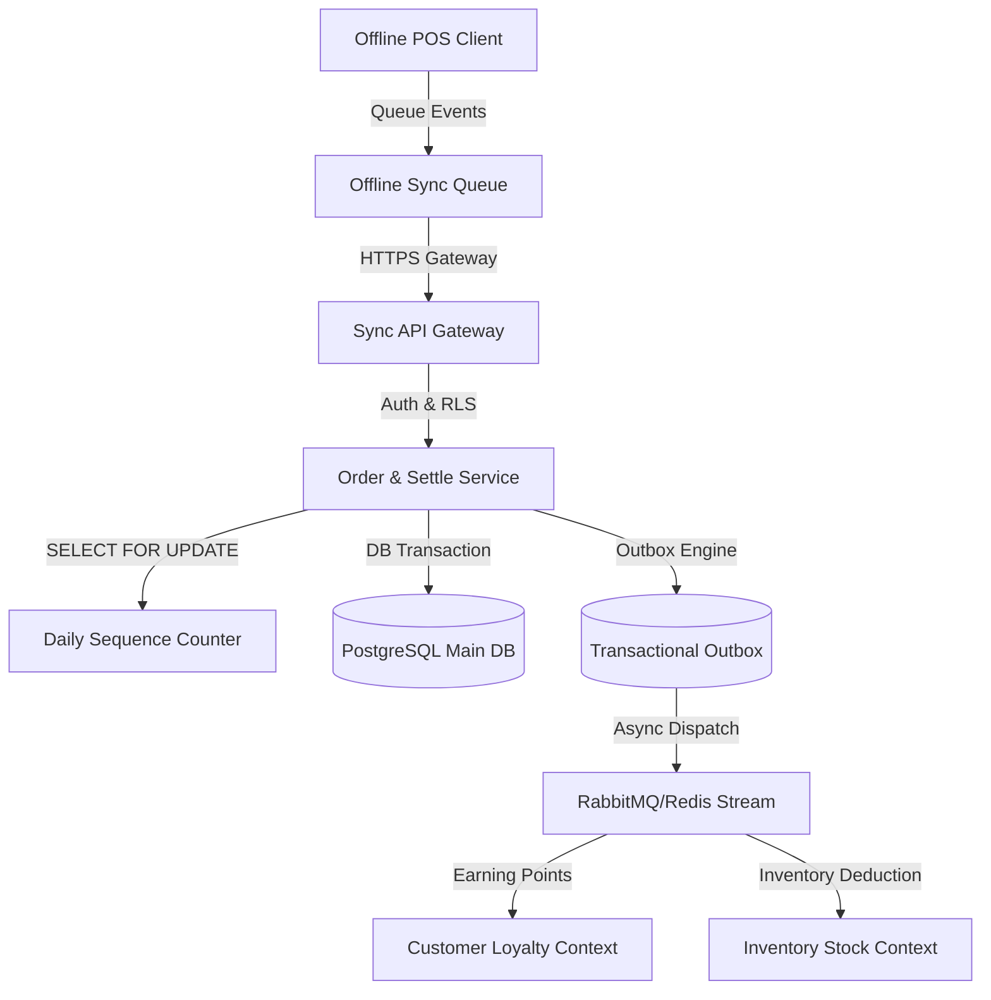

# ADR-0003: POS Billing Engine Architecture

**Status:** Proposed  
**Date:** 2026-06-27  
**Deciders:** Platform Architecture, Lead POS Architect, Finance & Tax Compliance Lead, Offline-Sync Lead Engineering  
**Context (bounded context):** `src/contexts/ordering`  
**Related:** ADR-0001 (Inventory Ledger), ADR-0002 (Customer Ledgers & Atomicity), PROJECT_CONTEXT §5 (`ordering`)

---

## Context & Problem Statement

Nextora POS is a multi-tenant, cloud-managed SaaS restaurant platform targeting 10,000+ tenants and 100,000+ concurrent cashier terminals. The billing engine at the core of the `ordering` context must support high-speed point-of-sale operations. 

Operational requirements include:
- **Service Channels:** Dine-In (linked to table layouts), Takeaway (upfront settlement), and Delivery (third-party integration or in-house driver dispatch).
- **Payment & Invoicing:** Split payments (multiple payment methods per bill), partial payments, accounts-receivable credit sales, refunds, tip tracking, rounding rules, and localized multi-layer tax rates (such as Indian CGST/SGST/IGST and cess).
- **Bill Mutations:** Splitting orders (by item, seat, or fraction) and merging multiple orders into a single check.
- **Reliability:** Strict transactional safety (no double payments), high-concurrency ticket locking, absolute idempotency, and a robust offline synchronization strategy ensuring business continuity when internet connectivity fails.

---

## Decision Drivers

1. **Financial Compliance & Audit Integrity:** Invoice numbers must be gapless, sequential, and partition-isolated by tenant, branch, and financial year.
2. **Deterministic Calculations:** Tax divisions, order-level discounts distributed proportionally across line items, and rounding logic must yield identical penny-accurate results on client terminals and backend servers.
3. **High Concurrency:** Database record contention must be minimized on active tables while preventing double-settlements.
4. **Offline Resilience:** Cashiers must be able to perform checkout, print bills, and capture cash/offline card payments while completely disconnected from the internet, syncing state later without introducing ledger anomalies.

---

## Proposed Architecture



We divide the Billing Engine into four key architectural layers:
1. **Mathematical Billing Model (Pure Domain)**: Deterministic, framework-free logic.
2. **Transactional Database Engine (State & Persistence)**: Relational models covering Orders, Invoices, Payments, and Sequence counters under row-level multi-tenancy.
3. **Operational State-Machine (Services)**: Transactional operations for splits, merges, and payment collection with strict concurrency gates.
4. **Offline-First Synchronization Framework**: A structured protocol for message routing, sequence reservation, and conflict resolution.

---

### 1. Pure Domain Calculations (Calculus & Math)

To handle mixed tax classes (e.g. food taxed at 5%, alcohol at 18%, and high-luxury items with cess), all math is calculated dynamically at the line item level.

- **Proportional Discount Allocation**: Order-level discounts (flat amount or percentages) are allocated to each active line item proportionally based on its weight in the subtotal.
  $$\text{Line Discount}_i = \text{Order Discount} \times \frac{\text{Line Subtotal}_i}{\sum \text{Line Subtotal}}$$
  Any remaining rounding errors are absorbed by the final line item in the order to guarantee that the sum of allocated discounts exactly equals the order-level discount.
- **Taxable Base**: Calculated on a per-line basis after applying both line-level and allocated order-level discounts.
- **Service Charge & Tips**: Service charges are computed on the pre-tax, post-discount taxable subtotal. Tips are kept separate from the taxable invoice subtotal and recorded as a non-taxable payment liability.
- **Rounding Rules**: Cash bills are rounded to the nearest integer unit (e.g., using half-up rounding to the nearest ₹1 or $1). Electronic payments (UPI, Card) are processed without rounding.
- **Numeric Data Types**: All financial fields must use `Decimal` values with 12 digits of precision and 2 decimal places (`Decimal(12,2)`) to avoid float rounding errors.

---

### 2. Transactional Database Models

Every table is multi-tenant partitioned and extends the standard platform base model `TenantAwareModel` (providing `tenant_id`, UUIDv4 PK, `created_at`, `updated_at`, audit tracking, and soft-delete capabilities).

```
┌────────────────────────────────────────────────────────┐
│                        Order                           │
├────────────────────────────────────────────────────────┤
│ uuid id (PK)                                           │
│ uuid tenant_id (FK)                                    │
│ uuid location_id                                       │
│ varchar order_number                                   │
│ varchar status (open, billed, paid, voided)            │
│ decimal total_amount                                   │
│ uuid split_from_id (Self-FK)                           │
│ uuid merged_into_id (Self-FK)                          │
└───────────┬────────────────────────────────────────────┘
            │ 1
            │
            │ 1..*
┌───────────▼────────────────────────────────────────────┐
│                      OrderItem                         │
├────────────────────────────────────────────────────────┤
│ uuid id (PK)                                           │
│ uuid product_id                                        │
│ decimal qty                                            │
│ decimal unit_price                                     │
│ decimal tax_rate                                       │
│ decimal line_total                                     │
└────────────────────────────────────────────────────────┘
```

- **Order Table (`order`)**: Tracks order metadata (table, seat, waiter, channel) and denormalized financial totals. It maintains self-referential lineage links (`split_from_id` and `merged_into_id`) to track order splits and merges.
- **OrderItem Table (`order_item`)**: Holds snapshots of ordered products, selected variants, and direct unit prices to protect historical order records from subsequent menu catalog modifications.
- **Payment Table (`order_payment`)**: Records payment events. It enforces a database constraint:
  `uq_payment__idempotency`: `Unique(tenant, idempotency_key)`
  This prevents duplicate charges when processing network retries.
- **Invoice Table (`tax_invoice`)**: An immutable, tenant-scoped record created when an order is settled. It stores the final invoice totals, customer tax IDs (e.g. GSTIN), and the formal sequential invoice number.

---

### 3. Concurrency, Locking, and State Transitions

To prevent double-billing and dirty writes under high concurrency (e.g. multiple waiters modifying a table order or multiple cashier terminals settling a bill simultaneously):

```
[Open] ──(Add Items)──► [Billed] ──(Apply Payment)──► [Paid]
  │                        │
  └──────(Void Order)──────┴──► [Voided]
```

- **State Locks**: When a cashier initiates billing (e.g., generating the final check), the order status changes from `open` to `billed`. This transition locks the order state, preventing waiters from adding or removing items until the check is either settled or unlocked by a manager.
- **Pessimistic Locking**: All write operations (such as adding payments, splitting, or voiding) must acquire a database row lock using Django's `select_for_update(of=('self',))` in a single transaction block.
- **Sequence Numbering**: To avoid database sequence gaps (which violate tax compliance rules), the system uses a `DailyCounter` record. The sequence is incremented atomically inside the order transaction:
  ```sql
  SELECT last_number FROM daily_counter 
  WHERE tenant_id = %s AND location_id = %s AND scope = 'invoice' AND date = %s 
  FOR UPDATE;
  ```
  This query blocks concurrent processes until the current transaction commits, ensuring sequential, gapless numbering.

---

### 4. Split and Merge Operations

#### Split Bills
POS terminals support splitting orders by item, quantity, or cost.
1. A transaction block locks the original order `OrderA` using `select_for_update`.
2. A new order record `OrderB` is created with its `split_from` foreign key set to `OrderA.id`.
3. Selected items are moved from `OrderA` to `OrderB`.
4. The totals for both orders are recalculated deterministically.
5. If the original order `OrderA` has no items remaining, it is marked as `voided` with the reason "Split Complete".

#### Merge Bills
POS terminals can merge multiple open orders (e.g., merging tables) into a single check.
1. The transaction locks all target orders (`OrderA`, `OrderB`, `OrderC`) using a sorted list of UUIDs to prevent deadlock conditions.
2. A new order `OrderParent` is created.
3. All items from the child orders are cloned and linked to the new `OrderParent`.
4. The original child orders are marked as `voided`, and their `merged_into` foreign key is set to `OrderParent.id`.

---

### 5. Offline Synchronization Strategy

To maintain operations when internet connectivity is lost, POS terminals use a local database (SQLite/IndexedDB) and follow a structured offline synchronization protocol:

```
[Client Offline POS] 
  │ 
  ├── 1. Generate Local UUID Client-side
  ├── 2. Reserve Local Offline Invoice Number: OFF-INV-{BranchID}-{ClientEpoch}
  ├── 3. Write Immutable Event Log (Order Created, Payment Received)
  │
(Connection Restored)
  │
  ▼
[Sync Engine Processing Queue]
  │
  ├── 4. Push Events in Chronological Order
  ├── 5. Server Validates Client-side Idempotency Keys
  ├── 6. Server Replaces Offline Number with Gapless Tax Invoice Number
  └── 7. Deduct Inventory & Credit Loyalty (Async Task Outbox)
```

1. **Client-side UUID Generation**: POS clients generate record IDs locally using standard UUIDv4. This avoids key collisions when syncing local records with the cloud database.
2. **Offline Invoice Series Reservation**: Local clients print temporary receipts using a dedicated offline sequence pattern:
   `OFF-INV-{BranchUUID}-{DeviceID}-{Counter}`
   When the connection is restored, the backend processes these transactions and generates a formal, compliant tax invoice number using the cloud-managed `DailyCounter` sequence.
3. **Event Sourcing for Sync Queue**: POS clients record all offline actions (e.g., `OrderCreated`, `PaymentCaptured`, `ShiftClosed`) in an immutable, append-only local event log.
4. **Chronological Sync Ingestion**: When connection is restored, the client pushes the event log to the server in chronological order.
5. **Idempotency Guard**: The server processes incoming events using the client-generated UUID as an idempotency key. If an event is retransmitted due to a network interruption, the server returns the cached response rather than executing the transaction again.
6. **Conflict Resolution Strategy**:
   - **Order Modification Conflict**: If an order is modified both online and offline during a network split, the server applies a **"Last-Write-Wins"** rule based on the event timestamp, unless the order has already been paid.
   - **Post-Payment Isolation**: Paid orders are immutable. Any offline modifications received after an order has been paid are rejected. In these cases, the system creates a compensating `AdjustmentOrder` to correct the variance.
7. **Downstream Processing**: Once the server accepts and commits synced orders, it publishes corresponding domain events via the transactional outbox. This triggers downstream actions like inventory deductions and loyalty points updates.

---

## Alternative Solutions Considered

### 1. Client-Generated Tax Invoice Numbers
* **Description**: POS clients generate sequential invoice numbers locally. The server accepts and records these client-generated numbers during sync.
* **Trade-off**:
  - *Pros*: Simple client-side implementation.
  - *Cons*: High risk of sequence gaps and duplicates if client clocks drift or local databases are reset. This would violate strict financial audit standards.

### 2. Distributed Locking (Redis Lock)
* **Description**: Using Redis-based locks (e.g., Redlock) to manage sequence counters instead of PostgreSQL database row locks.
* **Trade-off**:
  - *Pros*: Reduced database read load, fast lock execution times.
  - *Cons*: Decreased reliability if Redis cache memory is evicted. If a network split occurs between the app servers and the Redis cluster, the lock could fail, leading to duplicate sequence numbers.

### 3. Distributed Saga Pattern for Payment and Inventory
* **Description**: Orchestrating payment, inventory, and billing updates as a single distributed saga transaction across contexts.
* **Trade-off**:
  - *Pros*: Avoids strong database coupling between contexts.
  - *Cons*: Significantly increases system complexity and latency. If a step fails, the system must execute complex compensating transactions across services.

---

## Consequences

### What is Gained (Pros)
- **High Concurrency Performance**: Using state-based order locks reduces database read/write locks, keeping table contention low.
- **Accurate Financial Auditing**: Line-level tax and discount calculations ensure penny-accurate computations, preventing rounding discrepancies.
- **Resilient Offline Operations**: POS terminals can process transactions offline without risking data corruption or sequence collisions when syncing.
- **Guaranteed Idempotency**: System-wide idempotency keys protect the API from network retries and duplicate payments.

### What is Lost (Cons)
- **Sequence Serializability Bottleneck**: Sequential invoice numbering relies on pessimistic locks on the `DailyCounter` table, which limits write throughput for a single branch to database transaction speeds. However, because counters are partitioned by branch location, the load is distributed across tenants.
- **Database Storage Overhead**: Snapshotted item prices, tax classes, and modifiers on order items increase data storage requirements. This trade-off is necessary to protect historical sales records from menu catalog updates.
- **Offline Sync Latency**: Processing offline events in chronological order can introduce sync delays if a client has been disconnected for a long period of time.
