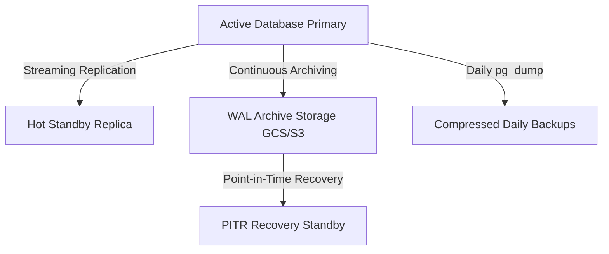

# PostgreSQL Schema Review & Optimization Report

This report presents an architectural audit of the PostgreSQL schema for Nextora POS, analyzing indexing efficiency, Row-Level Security (RLS) query paths, data integrity constraints, time-series partitioning, growth projection calculations, migration protocols, and disaster recovery strategies.

---

## 1. Schema Analysis & Indexing Strategy

### The Multi-Tenant Indexing Challenge
Nextora POS uses PostgreSQL Row-Level Security (RLS) to enforce tenant isolation. Every data-access query has a tenant filter injected dynamically by the middleware:
```sql
WHERE tenant_id = current_setting('app.current_tenant', true)::uuid
```
Because of this, standard single-column indexes on fields like `status` or `sku` are inefficient. PostgreSQL is forced to perform bitmap index scans and merge them with a filter on `tenant_id`.
* **Standard practice:** Every hot-path index must be a **composite index** starting with the `tenant_id` (or `tenant`) column.
* **Partial Indexes:** When querying rows in a specific state (e.g., active products or open orders), partial indexes containing `WHERE is_deleted = false` and `WHERE status = 'open'` significantly reduce index size and keep hot data in memory.

### Audit Findings
1. **Missing Analytical Indexes on `Order`:**
   - There are no indexes on `opened_at` or `settled_at` combined with the tenant. Daily closing processes and financial dashboards querying order history for a date range will perform full table scans per tenant.
2. **Missing Reconciliation Index on `Payment`:**
   - Reconciling daily registers requires querying payments by `captured_at`. The `order_payment` table lacks a composite index on `(tenant_id, captured_at)`.
3. **Missing CRM Index on `Customer`:**
   - Lookup of customer profiles by email currently performs a sequential scan within the tenant's data space because there is only a unique index on `(tenant_id, phone)`.

---

## 2. Growth Projections & Storage Calculation (3-Year Horizon)

### Sizing Parameters
* **Active Tenants ($T$):** 1,000
* **Branches per Tenant ($B$):** 2 (Total operational units = 2,000)
* **Average Orders per Branch per Day ($O$):** 200 (Total daily orders = 400,000)
* **Average Items per Order ($I$):** 3
* **Retention Horizon:** 3 Years (1,095 days)

### Table Sizing Estimates

| Table | Bytes per Row (Avg) | Daily Growth (Rows) | 3-Year Growth (Rows) | 3-Year Storage (Data + Index) |
| :--- | :--- | :--- | :--- | :--- |
| `order` | 500 B | 400,000 | 438,000,000 | **219 GB** (Data) + ~88 GB (Index) = **307 GB** |
| `order_item` | 400 B | 1,200,000 | 1,314,000,000 | **525 GB** (Data) + ~262 GB (Index) = **787 GB** |
| `order_payment` | 300 B | 450,000 | 492,750,000 | **147 GB** (Data) + ~59 GB (Index) = **206 GB** |
| `stock_movement` | 350 B | 1,600,000 | 1,752,000,000 | **613 GB** (Data) + ~350 GB (Index) = **963 GB** |
| `audit_log` | 1.2 KB | 2,500,000 | 2,737,500,000 | **3.2 TB** (Data) + ~820 GB (Index) = **4.02 TB** |

**Total Projected Database Size (3 Years): ~6.28 Terabytes**

---

## 3. Database Partitioning Strategy

Given the projected 3-year size of **6.28 TB**, partitioning is mandatory for high-volume write and time-series logging tables.

### 1. Range Partitioning: `audit_log`
* **Column:** `occurred_at`
* **Interval:** Monthly partitions (e.g., `audit_log_2026_06`).
* **Strategy:** Because this table is purely append-only, older monthly partitions can be detached and migrated to compressed read-only tablespaces or archived to cold object storage (S3/GCS) via pg_dump, keeping the active dataset under 150 GB.

### 2. Hash Partitioning: `order` and `order_item`
* **Column:** `tenant_id`
* **Strategy:** Multi-tenant SaaS workloads are horizontally scalable when partitioned by tenant. We will implement declarative Hash Partitioning (e.g., 32 or 64 hash buckets) by `tenant_id`. This aligns with RLS boundaries and enables PostgreSQL to prune partitions, confining queries to a single hash bucket.

---

## 4. Zero-Downtime Migration Strategy

Deploying migrations to a multi-tenant POS running 24/7 requires strict safety rules to avoid acquiring exclusive locks on large tables:

1. **Creating Indexes Concurrently:**
   - Never run `CREATE INDEX` directly. Always use `CREATE INDEX CONCURRENTLY` in raw SQL migrations, and set `atomic = False` in the Django Migration class.
2. **Migration Locks Timeout:**
   - Always set `lock_timeout` before executing schema migrations (e.g., `SET lock_timeout = '3s';`). If lock acquisition takes longer, the migration fails gracefully instead of queueing behind other operations and blocking the entire POS application.
3. **Avoid Default Values that Rewrite Tables:**
   - In PostgreSQL 11+, adding a column with a default value is instantaneous. However, adding columns with non-constant defaults or changing column types can trigger a full table rewrite. These operations must be executed in staged phases.

---

## 5. Backup & Disaster Recovery (DR) Plan

To meet enterprise SaaS SLA commitments, the database architecture implements the following DR topology:



### Recovery Objectives
* **Recovery Point Objective (RPO):** < 5 Minutes (amount of data loss in a disaster).
* **Recovery Time Objective (RTO):** < 15 Minutes (duration of service disruption).

### Backup Implementation
1. **Continuous Archiving (Write-Ahead Logs):**
   - Enable `archive_mode = on` and configure `archive_command` to upload WAL segments to geo-replicated object storage every 60 seconds (using pgBackRest or wal-g).
   - This enables **Point-in-Time Recovery (PITR)** to restore the database state to any microsecond within the retention window.
2. **Physical Hot Backups:**
   - Weekly full physical database backups using `pg_basebackup` or pgBackRest.
3. **Disaster Failover:**
   - Configure a Hot Standby Replica in a separate cloud availability zone. Failover is managed using Patroni + Consul to orchestrate automatic leader election and IP redirection, meeting the 15-minute RTO.

---

## 6. Optimization Plan: Implementing Missing Composite Indexes

We will immediately implement the missing hot-path composite indexes on the transactional tables identified in our audit:

1. **Order composite index for analytics:**
   - Add a composite index on `(tenant, opened_at)` on `Order` to speed up date-range queries.
2. **Order composite index for CRM lookups:**
   - Add a composite index on `(tenant, customer_phone)` on `Order` to speed up order history lookups.
3. **Payment composite index for reconciliation:**
   - Add a composite index on `(tenant, captured_at)` on `Payment` to optimize register reconciliation.
